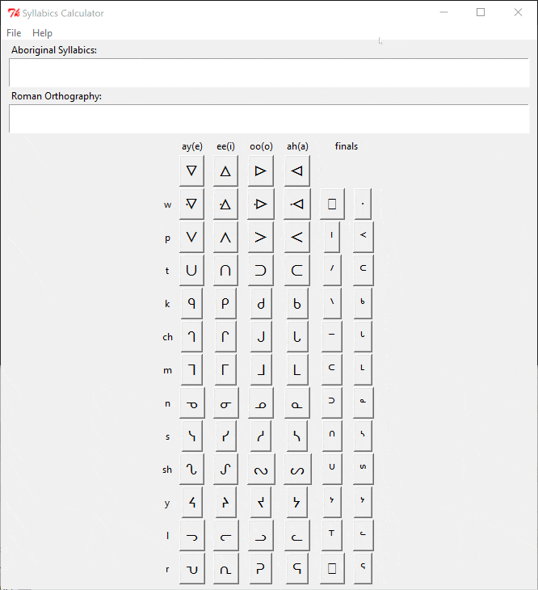

# AboriginalSyllabics

**About**
---
Developed a character map for quickly taking digital notes while taking a few native language courses at Lakehead University:
* Western Ojibwe with Tom Beardy (INDI1014 & INDI1016)
* Oji-Cree with Susan Sandau (CREE1010 & CREE1012)

### TODO:
* v2.0 was rewritten using python/tkinter. I found the compiled files made with py2app for both windows and mac but need to upload python version.

**Demo**

| Binaries | DOWNLOAD                         |
| ---------| ---------------------------------|
| Windows  | [v2.0 Release](https://github.com/xslim24x/AboriginalSyllabics/raw/main/syllabics_v2.0.exe), [v2.0 Small Font](https://github.com/xslim24x/AboriginalSyllabics/raw/main/syllabics_small_v2.0.exe) |
| MacOS    | [v2.0 Release](https://github.com/xslim24x/AboriginalSyllabics/raw/main/syllabicsmac_v2.0.app.zip) |
